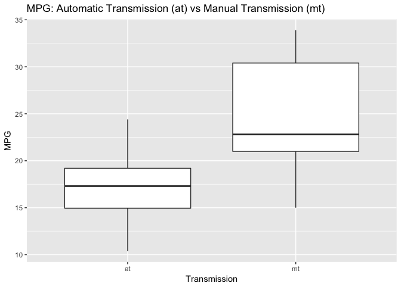
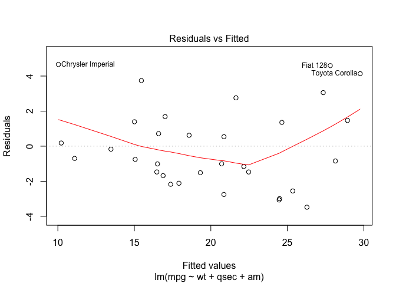
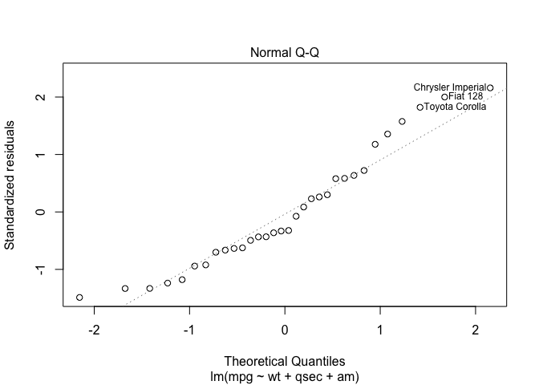
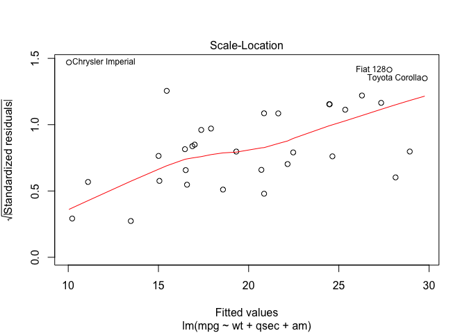
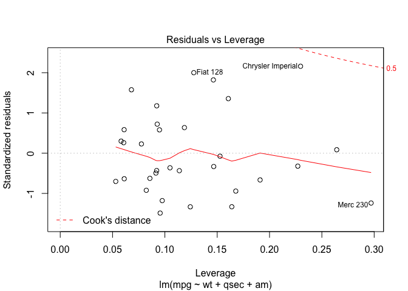

# Regression Models Course Project
Polina Filipova  
July 16, 2017  

<a name="top"></a>

## Overview

This document is generated as a course asignment for the __Regression Models__ course, offered by Johns Hopkins University on Coursera.<br><br>

<blockquote>&nbsp;&nbsp; You work for Motor Trend, a magazine about the automobile industry. Looking at a data set of a collection of cars, they are interested in exploring the relationship between a set of variables and miles per gallon (MPG) (outcome). They are particularly interested in the following two questions:

- &nbsp;&nbsp; Is an automatic or manual transmission better for MPG<br>
- &nbsp;&nbsp; Quantify the MPG difference between automatic and manual transmissions<br>

&nbsp;&nbsp; Take the <b>mtcars</b> data set and write up an analysis to answer their question using regression models and exploratory data analyses.</blockquote>

The following required steps can be reviewed below:

1.  [Data Overview](#step1) 
2.  [Automatic vs. Manual Transmission in relation to MPG](#step2) 
3.  [Conclusion](#step3)
4.  [Supporting Plots](#step4)
5.  [All of the R code needed to reproduce the results (numbers, plots, etc.)](#step5) 


### <a name="step1"></a>1. Data Overview

The mtcars data set is part of the base R installation.


```r
# As referenced in:
help(mtcars)
```

[__R: Motor Trend Car Road Tests__](https://stat.ethz.ch/R-manual/R-devel/library/datasets/html/mtcars.html)

__Description__

The data was extracted from the 1974 Motor Trend US magazine, and comprises fuel consumption and 10 aspects of automobile design and performance for 32 automobiles (1973–74 models).

__Usage__

mtcars

__Format__

A data frame with 32 observations on 11 variables.

[, 1]	mpg - Miles/(US) gallon<br>
[, 2]	cyl - Number of cylinders<br>
[, 3]	disp - Displacement (cu.in.)<br>
[, 4]	hp - Gross horsepower<br>
[, 5]	drat - Rear axle ratio<br>
[, 6]	wt - Weight (1000 lbs)<br>
[, 7]	qsec - 1/4 mile time<br>
[, 8]	vs - V/S<br>
[, 9]	am - Transmission (0 = automatic, 1 = manual)<br>
[,10]	gear - Number of forward gears<br>
[,11]	carb - Number of carburetors<br>

__Source__

Henderson and Velleman (1981), Building multiple regression models interactively. Biometrics, 37, 391–411.


```r
# Dimensions:
dim(mtcars)
```

```
## [1] 32 11
```

```r
# Column names:
names(mtcars)
```

```
##  [1] "mpg"  "cyl"  "disp" "hp"   "drat" "wt"   "qsec" "vs"   "am"   "gear"
## [11] "carb"
```

```r
# Row names:
rownames(mtcars)
```

```
##  [1] "Mazda RX4"           "Mazda RX4 Wag"       "Datsun 710"         
##  [4] "Hornet 4 Drive"      "Hornet Sportabout"   "Valiant"            
##  [7] "Duster 360"          "Merc 240D"           "Merc 230"           
## [10] "Merc 280"            "Merc 280C"           "Merc 450SE"         
## [13] "Merc 450SL"          "Merc 450SLC"         "Cadillac Fleetwood" 
## [16] "Lincoln Continental" "Chrysler Imperial"   "Fiat 128"           
## [19] "Honda Civic"         "Toyota Corolla"      "Toyota Corona"      
## [22] "Dodge Challenger"    "AMC Javelin"         "Camaro Z28"         
## [25] "Pontiac Firebird"    "Fiat X1-9"           "Porsche 914-2"      
## [28] "Lotus Europa"        "Ford Pantera L"      "Ferrari Dino"       
## [31] "Maserati Bora"       "Volvo 142E"
```

[Back to Overview](#top)

### <a name="step2"></a>2. Automatic vs. Manual Transmission in relation to MPG

Transmission (mtcars$am) can have one of two values, 0 for automatic and 1 for manual. To evade confusion, we will label them shortly.

A look at the means suggests immediate advantage for manual transmission, if our goal is to get more miles per galon (MPG).


```r
aggregate(mpg ~ am, data = mtcars, mean)
```

```
##   am      mpg
## 1  0 17.14737
## 2  1 24.39231
```

A visual comparison is available in Figure 1.

#### Hypothesis Testing

On performing a T Test, we see the p-value is (far) less than 0.05 (5% given a confidence interval of 95%).  Therefore, we reject the null hypothesis that there's no difference between the means and conclude that a significant difference does exist. The notion that manual transmission is a stronger factor for MPG increase is confirmed.


```r
# Factor mtcars$am and add labels for automated and manual transmission

mtcars$am <- as.factor(mtcars$am)
levels(mtcars$am) <- c("at", "mt")

# Perform T Test

mtcars_at <- mtcars[mtcars$am == "at", ]
mtcars_mt <- mtcars[mtcars$am == "mt", ]
t.test(mtcars_at$mpg, mtcars_mt$mpg)
```

```
## 
## 	Welch Two Sample t-test
## 
## data:  mtcars_at$mpg and mtcars_mt$mpg
## t = -3.7671, df = 18.332, p-value = 0.001374
## alternative hypothesis: true difference in means is not equal to 0
## 95 percent confidence interval:
##  -11.280194  -3.209684
## sample estimates:
## mean of x mean of y 
##  17.14737  24.39231
```

#### Linear Regression Model

Next, we model the data based on the dependence of MPG values of the transmission. The "ammt" estimate suggests that manual tranismission outperforms automated transmission by ~7.25 MPG. Multiple R-squared = Explained variance / Total variance for multiple regression. The variance in the data that can be explained by the type of transmission, is barely 36% (0.3598). Not our best bet.


```r
mtcars_am_lm <- lm(mpg ~ am, data = mtcars)
summary(mtcars_am_lm )
```

```
## 
## Call:
## lm(formula = mpg ~ am, data = mtcars)
## 
## Residuals:
##     Min      1Q  Median      3Q     Max 
## -9.3923 -3.0923 -0.2974  3.2439  9.5077 
## 
## Coefficients:
##             Estimate Std. Error t value Pr(>|t|)    
## (Intercept)   17.147      1.125  15.247 1.13e-15 ***
## ammt           7.245      1.764   4.106 0.000285 ***
## ---
## Signif. codes:  0 '***' 0.001 '**' 0.01 '*' 0.05 '.' 0.1 ' ' 1
## 
## Residual standard error: 4.902 on 30 degrees of freedom
## Multiple R-squared:  0.3598,	Adjusted R-squared:  0.3385 
## F-statistic: 16.86 on 1 and 30 DF,  p-value: 0.000285
```

How about the rest of the variables?


```r
mtcars_lm <- lm(mpg ~ ., data = mtcars)
summary(mtcars_lm)$coeff
```

```
##                Estimate  Std. Error    t value   Pr(>|t|)
## (Intercept) 12.30337416 18.71788443  0.6573058 0.51812440
## cyl         -0.11144048  1.04502336 -0.1066392 0.91608738
## disp         0.01333524  0.01785750  0.7467585 0.46348865
## hp          -0.02148212  0.02176858 -0.9868407 0.33495531
## drat         0.78711097  1.63537307  0.4813036 0.63527790
## wt          -3.71530393  1.89441430 -1.9611887 0.06325215
## qsec         0.82104075  0.73084480  1.1234133 0.27394127
## vs           0.31776281  2.10450861  0.1509915 0.88142347
## ammt         2.52022689  2.05665055  1.2254035 0.23398971
## gear         0.65541302  1.49325996  0.4389142 0.66520643
## carb        -0.19941925  0.82875250 -0.2406258 0.81217871
```

With a linear model, it is not possible to identify a leader at a glance. We will use R's embedded step function, to perform the identification for us.

#### Stepwise Regression Model

In a stepwise manner, this function identifies the variables which affect MPG the most. Those appear to be weight and acceleration (quarter miles per second), followed by manual transmission, which tops automated transmission by at least ~2.94 MPG.

The adjusted R squared value (adjusted to evade overfitting, given greater number of predictors) is very close to the Multiple R squared value - overall high, in the 80th percentile. It would appear that data variance is highly explainable using this model.


```r
mtcars_step = step(lm(data = mtcars, mpg ~ .), trace = 0, steps = 10000)
summary(mtcars_step)
```

```
## 
## Call:
## lm(formula = mpg ~ wt + qsec + am, data = mtcars)
## 
## Residuals:
##     Min      1Q  Median      3Q     Max 
## -3.4811 -1.5555 -0.7257  1.4110  4.6610 
## 
## Coefficients:
##             Estimate Std. Error t value Pr(>|t|)    
## (Intercept)   9.6178     6.9596   1.382 0.177915    
## wt           -3.9165     0.7112  -5.507 6.95e-06 ***
## qsec          1.2259     0.2887   4.247 0.000216 ***
## ammt          2.9358     1.4109   2.081 0.046716 *  
## ---
## Signif. codes:  0 '***' 0.001 '**' 0.01 '*' 0.05 '.' 0.1 ' ' 1
## 
## Residual standard error: 2.459 on 28 degrees of freedom
## Multiple R-squared:  0.8497,	Adjusted R-squared:  0.8336 
## F-statistic: 52.75 on 3 and 28 DF,  p-value: 1.21e-11
```

#### Residuals

"R-squared is a statistical measure of how close the data are to the fitted regression line. (...) R-squared cannot determine whether the coefficient estimates and predictions are biased, which is why you must assess the residual plots."<br>
-- [Jim Frost](http://blog.minitab.com/blog/adventures-in-statistics-2), ["Regression Analysis: How Do I Interpret R-squared and Assess the Goodness-of-Fit?"]([http://blog.minitab.com/blog/adventures-in-statistics-2/regression-analysis-how-do-i-interpret-r-squared-and-assess-the-goodness-of-fit)

We will do so below, in Figure 2. The distribution of residuals is shown to be normal (Normal Q-Q). Residuals are fairly randomly distributed, i.e. are not relevant to the method (Residuals vs. Fitted). No residuals cross Cook's distance; - there are no influential outliers.

[Back to Overview](#top)

### <a name="step3"></a>3. Conclusion

A manual transmission has a small advantage as opposed to automatic, when it comes to miles per galon (MPG). Weight and acceleration, however, influence MPG to a much greater degree.

[Back to Overview](#top)

### <a name="step4"></a>4. Supporting Plots

#### Figure 1. Correlation between different types of transimssion and MPG


```r
# Note: This R Markdown portion is not "chatty";
# warnings on package installation are not displayed

if(!require(ggplot2)) { install.packages("ggplot2") }
library(ggplot2)
```


```r
# Create a side by side comparison using boxplots

ggplot(data = mtcars, aes(am, mpg)) + geom_boxplot() + labs(x = "Transmission", y = "MPG", title = "MPG: Automatic Transmission (at) vs Manual Transmission (mt)")
```

<!-- -->

#### Figure 2. Residuals vs. Fitted Line and more


```r
# Using the stepwise model

plot(mtcars_step)
```

<!-- --><!-- --><!-- --><!-- -->

[Back to Overview](#top)

### <a name="step5"></a>5. All of the R code needed to reproduce the results (numbers, plots, etc.)

Please refer to the parent folder of this GitHub submission for the mtcars_regression.Rmd file.

https://github.com/VoidHamlet/coursera_regression

[Back to Overview](#top)
